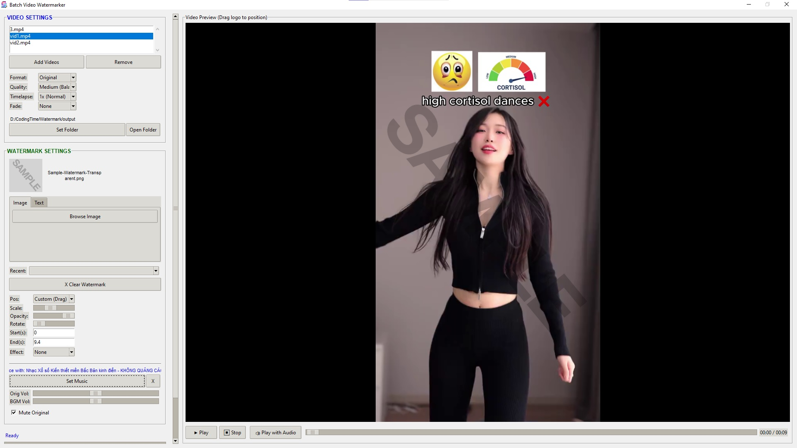
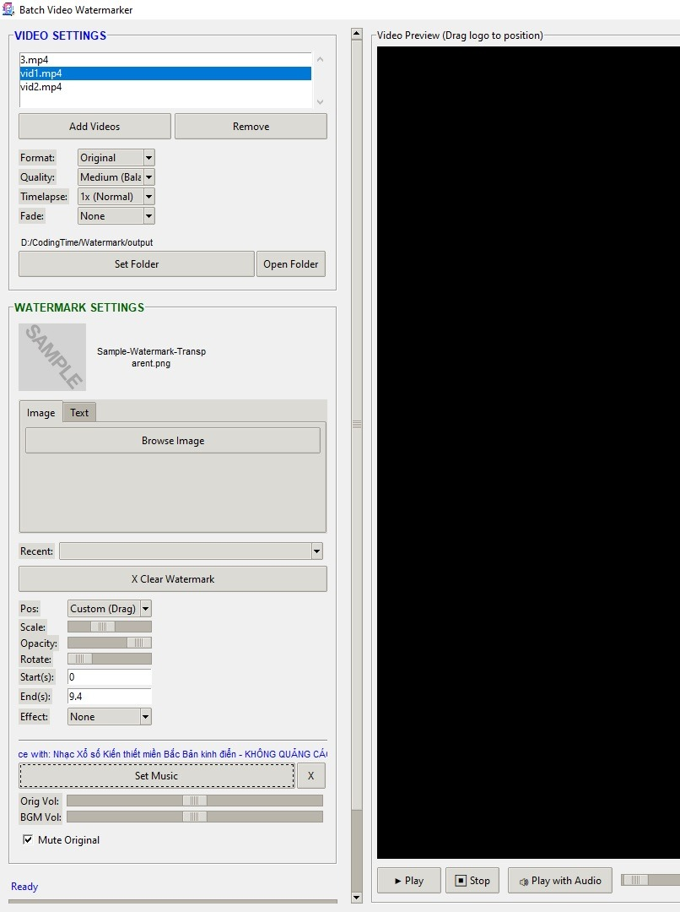
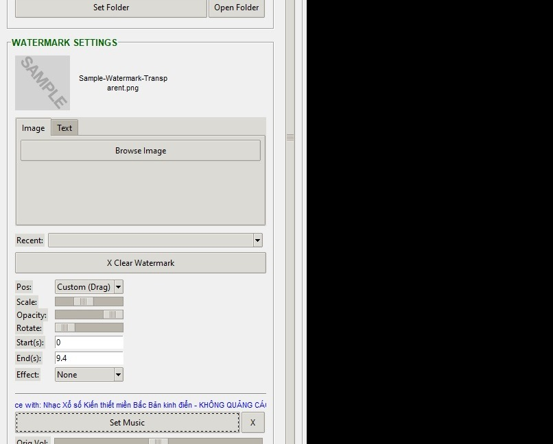
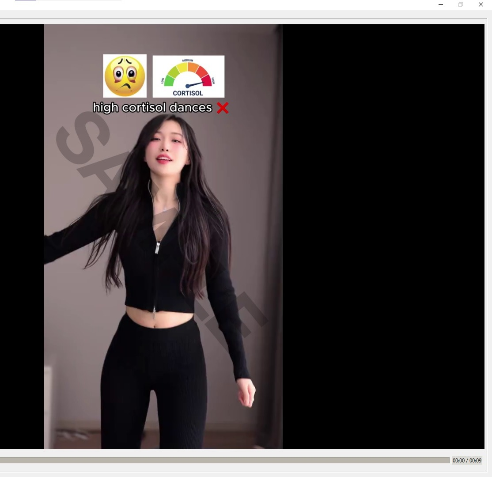

# Batch Video Watermarker



Desktop app for batch watermarking videos with image or text overlays. The app supports multiple input aspect ratios, live preview, audio options, and faster export using parallel processing and optional NVIDIA GPU encoding.

## Screenshots

### Full App


### Sidebar



### Export And Advanced



### Preview Area



## Features

### Video Processing
- Batch process multiple videos in one run.
- Accept common video inputs such as MP4, AVI, MOV, and MKV.
- Export in Original, MP4, MKV, AVI, or MOV container format.
- Choose output quality: High, Medium, or Low.
- Change playback speed with presets from `0.5x` to `16x`.
- Apply video fade in/out.

### Watermark Tools
- Use an image watermark (`PNG`, `JPG`, `JPEG`) or generate a text watermark inside the app.
- Adjust watermark position, size, transparency, rotation, timing, and entrance effect.
- Drag the watermark directly in the preview for custom placement.
- Reuse recent watermark history.

### Audio
- Keep original audio, mute it, or mix in background music.
- Control original audio volume and music volume separately.
- Generate a short preview sample with audio before full export.

### Performance
- Process multiple videos in parallel.
- Auto-tune the number of videos processed at once based on CPU or GPU mode.
- Support `Auto`, CPU-only, or NVIDIA GPU encoding when available.
- Copy unchanged audio directly when possible to reduce processing time.
- Use cached metadata probing to reduce repeated file analysis overhead.

### UI
- Split into `Videos`, `Watermark`, `Export`, and `Advanced` sections.
- Live preview with play, stop, seek, and drag-to-position behavior.
- Advanced settings can be shown or hidden from the export section.

## Typical Workflow

1. Click `Add Videos` and choose the source files.
2. In `Watermark`, choose either an image or text watermark.
3. Adjust the watermark in the preview.
4. In `Export`, choose output format, quality, and output folder.
5. Optionally open `Advanced` to adjust speed, fade, encoder, audio, or parallel export settings.
6. Click `Start Export`.

## Run From Source

Install dependencies:

```bash
pip install -r requirements.txt
```

If you do not have a `requirements.txt`, install the main packages manually:

```bash
pip install imageio-ffmpeg opencv-python pillow
```

Run the app:

```bash
python watermark_app.py
```

## Build Windows Executable

This project includes a PyInstaller spec file:

- [`Batch Video Watermarker.spec`](/D:/CodingTime/Watermark/Batch%20Video%20Watermarker.spec)

Install PyInstaller:

```bash
python -m pip install pyinstaller
```

Build using the spec file:

```bash
python -m PyInstaller "Batch Video Watermarker.spec"
```

The built app will be created in:

```text
dist/Batch Video Watermarker/
```

## Windows Icon

The app now uses:

- [`logo.png`](/D:/CodingTime/Watermark/logo.png) for the window icon at runtime
- [`logo.ico`](/D:/CodingTime/Watermark/logo.ico) for the Windows executable and taskbar icon

If you change the branding image, regenerate `logo.ico` before rebuilding the executable.

## Notes

- Output video is re-encoded because watermark overlay requires video processing.
- Audio is only stream-copied when no audio modification is needed.
- GPU encoding depends on FFmpeg support and available hardware.
